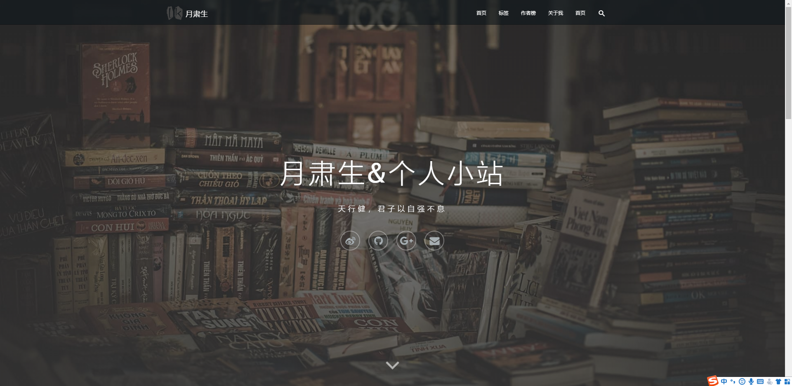
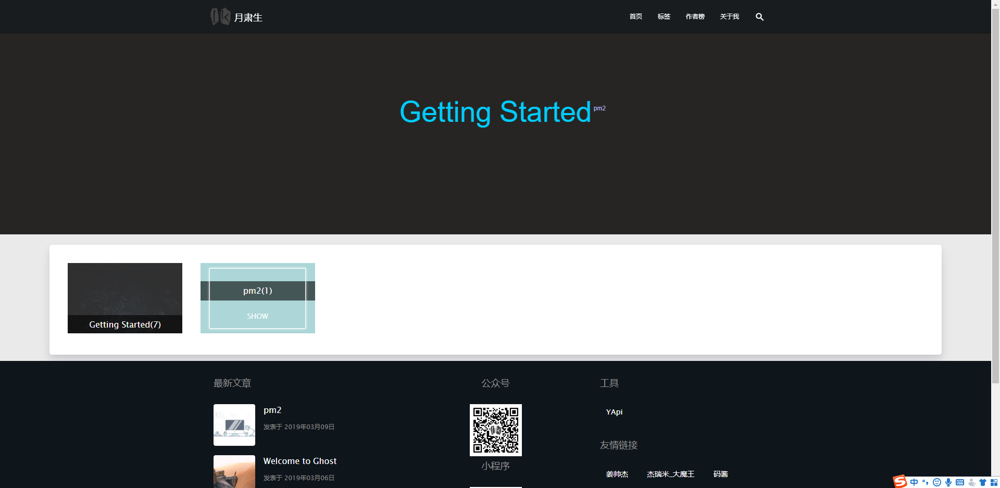

# [Puff](https://github.com/gitHber/puff/) &middot; [](./LICENSE)
## Puff


> 一款ghost主题，基于[Maple](https://github.com/KINGMJ/maple)和[ghost-theme-mj](https://github.com/luokangyuan/ghost-theme-mj)修改
## 🏷️ 特性
- Maple优秀的界面
- [gsearch](https://github.com/ViggoZ/gsearch)全局模糊搜索
- 标签和作者统计，标签云生成
- 响应式布局

## ⚙️ 安装
1. 进入到你的主题文件夹目录`ghost/content/themes`
2. 使用下面的命令克隆主题仓库
    ```
    $ git clone https://github.com/gitHber/puff.git
    ```
3. 重启 Ghost 并进入后台管理系统
4. 进入`Design`页面，选择`puff`主题，点击`ACTIVE`
## ⚙️配置url
只需要`git clone`或直接下载该主题，在后台切换主题。
需要在`/content/settings/routes.yaml`修改配置
```yaml
routes:
  /about-me/: about-me
  /tags/: tags
  /authors/: authors
collections:
  /:
    permalink: '/{slug}/'
    template:
      - index

taxonomies:
  tag: /tag/{slug}/
  author: /author/{slug}/
```
## License
Puff is [MIT licensed](./LICENSE).


